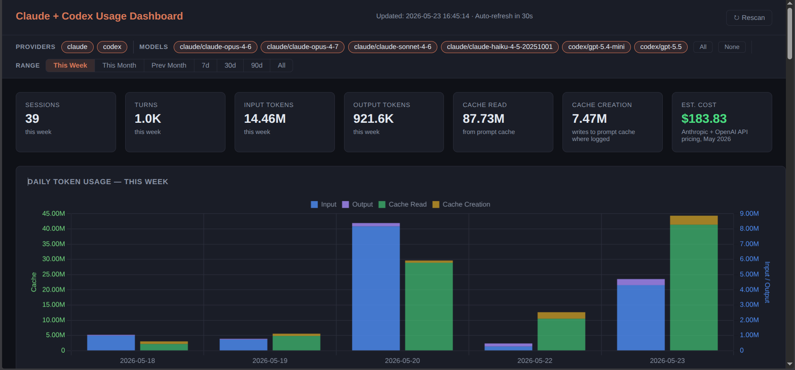

# Claude + Codex Usage Dashboard

[](LICENSE)
[](https://claude.ai/code)

**A local usage dashboard for Claude Code and OpenAI Codex sessions.**

Claude Code and OpenAI Codex both write detailed local usage logs: token counts, models, sessions, projects, branches, and cached-input usage. This dashboard reads both sources and shows Claude + Codex activity in one local web UI.



**Original project by:** [The Product Compass Newsletter](https://www.productcompass.pm)

**Fork maintained by:** [kawsher-hridoy](https://github.com/kawsher-hridoy)

---

## What this tracks

Works with local Claude Code and Codex logs. Claude Code writes local usage logs regardless of subscription type, and Codex writes rollout session logs under `~/.codex/sessions/`.

Captures usage from:
- **Claude Code CLI** (`claude` command in terminal)
- **VS Code extension** (Claude Code sidebar)
- **Dispatched Code sessions** (sessions routed through Claude Code)
- **OpenAI Codex CLI** (`~/.codex/sessions/**/*.jsonl`)

**Not captured:**
- **Cowork sessions** — these run server-side and do not write local JSONL transcripts

---

## Requirements

- Python 3.8+
- No third-party packages — uses only the standard library (`sqlite3`, `http.server`, `json`, `pathlib`)

> Anyone running Claude Code already has Python installed.

## Quick Start

No `pip install`, no virtual environment, no build step.

### Windows
```
git clone https://github.com/kawsher-hridoy/Claude-Codex-Usage
cd Claude-Codex-Usage
python cli.py dashboard
```

### macOS / Linux
```
git clone https://github.com/kawsher-hridoy/Claude-Codex-Usage
cd Claude-Codex-Usage
python3 cli.py dashboard
```

---

## Usage

> On macOS/Linux, use `python3` instead of `python` in all commands below.

```
# Scan JSONL files and populate the database (~/.claude/usage.db)
python cli.py scan

# Show today's usage summary by model (in terminal)
python cli.py today

# Show the last 7 days (per-day breakdown + by-model totals)
python cli.py week

# Show all-time statistics (in terminal)
python cli.py stats

# Scan + open browser dashboard at http://localhost:8080
python cli.py dashboard

# Custom host and port via environment variables
HOST=0.0.0.0 PORT=9000 python cli.py dashboard

# Scan a custom Claude projects directory
python cli.py scan --projects-dir /path/to/claude/transcripts

# Scan a custom Codex sessions directory
python cli.py scan --codex-sessions-dir /path/to/codex/sessions

# Scan both custom sources
python cli.py scan --projects-dir /path/to/claude/transcripts --codex-sessions-dir /path/to/codex/sessions
```

The scanner is incremental — it tracks each file's path and modification time, so re-running `scan` is fast and only processes new or changed files.

By default, the scanner checks `~/.claude/projects/`, the Xcode Claude integration directory (`~/Library/Developer/Xcode/CodingAssistant/ClaudeAgentConfig/projects/`), and `~/.codex/sessions/`, skipping any that don't exist. Use `--projects-dir` or `--codex-sessions-dir` to scan a custom location instead.

---

## How it works

Claude Code writes one JSONL file per session to `~/.claude/projects/`. Codex writes rollout JSONL files under `~/.codex/sessions/`. Each Claude `assistant`-type record contains:
- `message.usage.input_tokens` — raw prompt tokens
- `message.usage.output_tokens` — generated tokens
- `message.usage.cache_creation_input_tokens` — tokens written to prompt cache
- `message.usage.cache_read_input_tokens` — tokens served from prompt cache
- `message.model` — the model used (e.g. `claude-sonnet-4-6`)

`scanner.py` parses those files plus Codex `event_msg` / `token_count` records and stores the data in a SQLite database at `~/.claude/usage.db`.

`dashboard.py` serves a single-page dashboard on `localhost:8080` with Chart.js charts (loaded from CDN). It auto-refreshes every 30 seconds and supports provider/model filtering with bookmarkable URLs. The bind address and port can be overridden with `HOST` and `PORT` environment variables (defaults: `localhost`, `8080`).

---

## Cost estimates

Cost estimates use **Anthropic API pricing for Claude models** ([claude.com/pricing#api](https://claude.com/pricing#api)) and **OpenAI API pricing for GPT/Codex models** ([openai.com/api/pricing](https://openai.com/api/pricing/)) as of May 2026. Local models and unknown model names are excluded (shown as `n/a`).

| Model | Input | Output | Cache Write | Cache Read |
|-------|-------|--------|------------|-----------|
| claude-opus-4-7 | $5.00/MTok | $25.00/MTok | $6.25/MTok | $0.50/MTok |
| claude-opus-4-6 | $5.00/MTok | $25.00/MTok | $6.25/MTok | $0.50/MTok |
| claude-sonnet-4-6 | $3.00/MTok | $15.00/MTok | $3.75/MTok | $0.30/MTok |
| claude-haiku-4-5 | $1.00/MTok | $5.00/MTok | $1.25/MTok | $0.10/MTok |
| gpt-5.5 | $5.00/MTok | $30.00/MTok | n/a | $0.50/MTok |
| gpt-5.4 | $2.50/MTok | $15.00/MTok | n/a | $0.25/MTok |
| gpt-5.4-mini | $0.75/MTok | $4.50/MTok | n/a | $0.075/MTok |
| gpt-5.4-nano | $0.20/MTok | $1.25/MTok | n/a | $0.02/MTok |
| gpt-5.3-codex | $1.75/MTok | $14.00/MTok | n/a | $0.175/MTok |

> **Note:** These are API prices. If you use Claude Code via a Max or Pro subscription, your actual cost structure is different (subscription-based, not per-token).

---

## Files

| File | Purpose |
|------|---------|
| `scanner.py` | Parses JSONL transcripts, writes to `~/.claude/usage.db` |
| `dashboard.py` | HTTP server + single-page HTML/JS dashboard |
| `cli.py` | `scan`, `today`, `week`, `stats`, `dashboard` commands |
